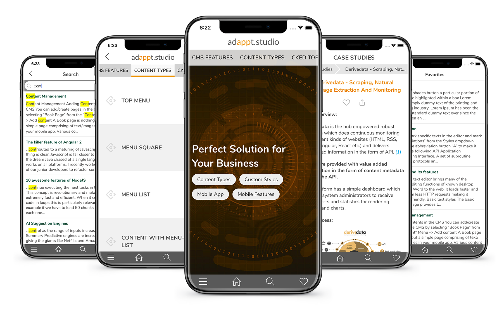

<h1 align="center">
  <br>
    
  <br>
  adappt studio
  <br/>
  <br/>
</h1>

<p align="center"></p>

## Overview

adappt studio is a content rendering platform for mobile devices. User will be able to feed in any type of content like RSS, editable content, either through forms, rich media or charts and it will be delivered on both IOS and Android devices in a structured tile format with features like global search, favourite and content share to social network applications.

## Key Features

* Share contents across major social media
* Favourite
* Global Search
* Breadcrumb Navigation
* Swipe Navigation
* Related Contents
* Works in Offline
* Analytics
* Support both IOS and Android

## How To Use

```bash
# Clone this repository
$ git clone https://github.com/adappt/mobile-publishing-studio

# Go into the repository
$ cd mobile-publishing-studio

# Install dependencies
$ npm install
$ react-native link

# For macOS Users - Pod install
$ cd ios
$ pod install

# iOS
$ react-native run-ios

# Android
$ react-native run-android
```

## You may also like...
- [Billable Hours](https://github.com/adappt/billable-hours) - A Task Management for employees
- [Rainbow Colors](https://github.com/adappt/rainbow-colors) - Evenly spaced non random color generator
## License
[MIT](https://choosealicense.com/licenses/mit/)